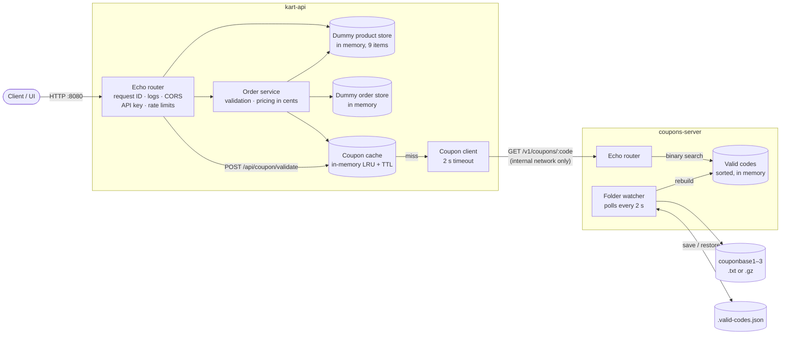

# Architecture

Two Go services, run together with Docker Compose:

- **kart-api** is the public API from [api/openapi.yaml](api/openapi.yaml). It serves products, orders and a coupon check.
- **coupons-server** is internal. It works out which promo codes are valid from the three coupon base files and answers lookups.

They are separate processes because their needs are very different. Building the coupon set reads about 3 GB of text, takes 18–30 s and peaks near 3 GB of memory. The API needs a few MB and starts instantly. Keeping them apart means:
- a coupon rebuild can't slow the API down or run it out of memory
- either service can be redeployed or scaled on its own
- if coupons are down, orders without a coupon still work

## Contents

- [Diagram](#diagram)
- [Coupons](#coupons)
  - [The rule](#the-rule)
  - [What the data looks like](#what-the-data-looks-like)
  - [How the valid set is built](#how-the-valid-set-is-built-internalcoupons)
  - [How coupons are served](#how-coupons-are-served-internalcouponsservicego-internalcouponsapi)
  - [How kart-api uses it](#how-kart-api-uses-it-internalcouponclient)
  - [When things fail](#when-things-fail)
- [Decisions](#decisions)
  - [Made for production](#made-for-production)
  - [Made only for this assignment](#made-only-for-this-assignment)
- [API notes](#api-notes)
- [Configuration](#configuration)
- [Where things are](#where-things-are)
- [Future scope](#future-scope)

## Diagram



<details>
<summary>Same diagram in plain text</summary>

```text
  Client / UI
       |  HTTP :8080
       v
+--------------------------------------------------------------------+
| kart-api                                                           |
|                                                                    |
| +------------------------------------------------------------+     |
| | Echo router                                                |     |
| | request ID . logs . CORS . API key . rate limits           |     |
| +------------------------------------------------------------+     |
|     | products            | orders                | coupon check   |
|     v                     v                       |                |
| +-------------------+  +-----------------------+  |                |
| | Dummy product     |  | Order service         |  |                |
| | store (in memory, |<-| validation, pricing   |  |                |
| | 9 items)          |  | in cents              |  |                |
| +-------------------+  +-----------------------+  |                |
|                             |               |     |                |
|                             v               v     v                |
|                 +-------------------+   +---------------------+    |
|                 | Dummy order store |   | Coupon cache        |    |
|                 | (in memory)       |   | in-memory LRU + TTL |    |
|                 +-------------------+   +---------------------+    |
|                                                   | miss           |
|                                                   v                |
|                                         +---------------------+    |
|                                         | Coupon client       |    |
|                                         | 2 s timeout         |    |
|                                         +---------------------+    |
|                                                   |                |
+---------------------------------------------------|----------------+
                                                    |  GET /v1/coupons/:code
                                                    |  (internal network only)
                                                    v
+--------------------------------------------------------------------+
| coupons-server                                                     |
|                                                                    |
|   +-------------+                 +----------------------+         |
|   | Echo router |--binary search->| Valid codes          |         |
|   +-------------+                 | sorted, in memory    |         |
|                                   +----------------------+         |
|                                              ^ rebuild             |
|                                              |                     |
|                                   +----------------------+         |
|                                   | Folder watcher       |         |
|                                   | polls every 2 s      |         |
|                                   +----------------------+         |
|                                       |             ^ |            |
+---------------------------------------|-------------|-|------------+
                                        v             | v
                            couponbase1-3            .valid-codes.json
                            (.txt or .gz)            (save / restore)
```

</details>

How an order with a coupon is handled:
1. The router assigns a request ID and checks the `api_key` and the rate limit.
2. The order service validates the items.
3. It asks the coupon cache about the code. On a miss, the client calls coupons-server, passing the request ID along.
4. The order is priced in integer cents, given a time-ordered UUIDv7 ID and saved in the dummy order store.

## Coupons

### The rule
A promo code is valid if it is 8–10 characters long and appears in at least two of `couponbase1`, `couponbase2` and `couponbase3`.

### What the data looks like
The three files hold 313 million lines in total, about 3.1 GB uncompressed:

| File | Lines | Contents |
|---|---|---|
| couponbase1 | 107,260,777 | All 8 characters, with 2,077 duplicate lines |
| couponbase2 | 107,260,776 | 9 characters, plus 8 eight-character lines at the end |
| couponbase3 | 98,566,152 | 10 characters, plus 8 eight-character lines at the end |

**Only 8 codes are valid:** `BIRTHDAY`, `BUYGETON`, `FIFTYOFF`, `FREEZAAA`, `GNULINUX`, `HAPPYHRS`, `OVER9000`, `SIXTYOFF`.

- `HAPPYHRS` is in files 1 and 3 only. The rest are in more files.
- `SUPER100` (file 1 only) and `MOODYHRS` (file 2 only) are decoys.
- `HAPPYHOURS` and `BUYGETONE`, from the front-end brief, are not valid under these rules.

The code doesn't take shortcuts from this layout. For example, it doesn't just compare the eight-character tail lines. It computes the answer for any input files, so new files would still give a correct result.

### How the valid set is built ([internal/coupons](internal/coupons/coupons.go))
A `map[string]int` over 313 million strings would need tens of GB, so the build works on packed integers instead:

1. **Read:** each file is streamed line by line, with `.gz` files decompressed on the fly. Any line that isn't 8–10 characters of `[0-9A-Za-z]` is dropped.
2. **Pack:** each code is packed into a `uint64`, 6 bits per character over 60 bits. Shorter codes are padded so that integer order equals string order. That costs 8 bytes per code.
3. **Sort and de-duplicate per file:** a code repeated within one file counts once. Without this step, file 1's 2,077 duplicates would become false positives.
4. **Merge:** one merge pass over the sorted files counts how many files contain each code, and keeps those found in at least 2.

Files are processed concurrently. Memory peaks at about 8 bytes per line (about 2.5 GB) and is returned to the OS afterwards. A build takes about 18 s from `.txt` or about 30 s from `.gz` on a 16-core machine. The tests check the merge against a simple map count on random data.

### How coupons are served ([internal/coupons/service.go](internal/coupons/service.go), [internal/couponsapi](internal/couponsapi/handler.go))
- **Watching the folder:** coupons-server polls its folder every 2 s. It rebuilds when the contents change and have looked the same on two polls in a row, so half-copied files are never read.
- **Rebuilds:** the old codes keep being served until the new set is ready, and a failed build keeps them too.
- **Saved results:** after a successful build the codes are saved to `.valid-codes.json`, together with each file's name, size and modification time. A restart with unchanged files restores them in milliseconds instead of rebuilding.
- **Lookups:** `GET /v1/coupons/:code` binary-searches the sorted codes. It answers 200 `{code, discountPercent}`, 404 for an unknown code, or 503 with `Retry-After` until the first build finishes. `/ready` reports the same state.

### How kart-api uses it ([internal/couponclient](internal/couponclient))
- **Format check first:** a code that isn't 8–10 letters or digits is rejected without a network call.
- **Caching:** valid answers are cached for 5 minutes and invalid ones for 1 minute. "Unavailable" is never cached.
- **Exact match:** codes are case-sensitive, so `happyhrs` is invalid.
- **Discount:** the brief says how to decide whether a code is valid, but not what discount a valid code gives. So every valid code gets a flat 10%, taken off the subtotal and rounded half up to the cent. The percentage is set by `COUPONS_DISCOUNT_PERCENT` on the coupons server and can be changed there. Coupons-server returns it with each lookup, so per-coupon rules could be added later without changing kart-api.

### When things fail

| Situation | Behaviour |
|---|---|
| coupons-server loading or down, order has no coupon | Normal 200 |
| …order has a code checked within its cache TTL | Answered from the cache |
| …order has any other code | **503** with `Retry-After: 5`. A discount is never silently dropped or granted unchecked |
| Coupon files change | Rebuilt in the background; the old set is served meanwhile |
| A rebuild fails | The previous set is kept |
| kart-api receives SIGTERM | `/ready` turns 503, then requests drain for up to 15 s |

## Decisions

### Made for production

These choices would stay as they are in a real deployment.

| Decision | Why |
|---|---|
| **Go 1.27** | The brief's suggested language. One static binary per service, cheap concurrency for the coupon build, and a strong standard library (`log/slog`, `net/http`, `slices`). |
| **Echo v5** | Built-in middleware for request ID, structured access logs, recover, CORS, key auth and rate limiting. One central error handler renders the spec's `ApiResponse` shape, and graceful start/stop is built in. |
| **Viper** | 12-factor configuration from environment variables, with an optional config file, defaults, and validation at startup. |
| **Separate coupons service** | A build that is heavy on memory and CPU is kept apart from the request path. A coupon outage only affects orders that include a coupon. |
| **Coupon cache, hashicorp/golang-lru with TTLs** | Repeated checks don't hit coupons-server, and recently checked codes keep working while it is down. The cache is bounded so it can't grow without limit, and invalid answers expire sooner than valid ones. |
| **Saved coupon results** | A restart with unchanged files is ready in milliseconds instead of rebuilding for about 30 s. |
| **Packed-integer build** | Handling 313 million lines needs about 2.5 GB, where a hash map would need tens of GB (see [Coupons](#how-the-valid-set-is-built-internalcoupons)). |
| **Money in integer cents** | No floating-point rounding errors. Floats appear only in the JSON the spec requires. |
| **API key scopes, per-IP rate limits, trusted-proxy list** | 401 vs 403 as the spec intends. Order and coupon endpoints are protected from abuse, and `X-Forwarded-For` can't be spoofed. |
| **Readiness, liveness, graceful shutdown** | A load balancer can stop routing traffic before in-flight requests are drained. |
| **Distroless, non-root, read-only containers with memory limits** | Small (about 19 MB) images with little to attack. A coupon build can't starve the host of memory. |

### Made only for this assignment

These shortcuts keep the project small and runnable with one command. Each sits behind an interface or a configuration setting, so it can be replaced without redesigning anything.

| Shortcut | In production |
|---|---|
| **Dummy in-memory product and order stores**, behind `product.Store` and `order.Store` | A database such as Postgres. Today orders are lost on restart and only one API replica can run. |
| **Fixed demo catalogue** of 9 products, with images hosted on the demo site | Products managed in the database, with images on a CDN. |
| **In-memory cache and rate-limit state**, per process | Redis through the existing `cache.Cache` interface and a Redis rate-limit store, so replicas share them. |
| **Packed-integer build** | Works well enough, but I'd prefer a proper data store instead of working with files with no backups. |
| **Static API key** `apitest`, set in an environment variable | Keys issued, hashed and rotated through a secret manager, or real user authentication. |
| **Flat 10% discount for every valid code**, set by `COUPONS_DISCOUNT_PERCENT` | Per-coupon rules in a store: amount, expiry and conditions such as "lowest-priced item free". |
| **Coupon files on a local volume**, filled by an init container | A build job publishes the valid set to object storage, and coupons-server instances pull it. |
| **A single coupons-server instance polling its folder** | Several replicas loading the published set, behind a service address. |
| **Plain HTTP, CORS `*` by default** | TLS terminated at the load balancer, and CORS restricted to the shop's own domains. |

## API notes

| Endpoint | Notes |
|---|---|
| `GET /api/product` | All products |
| `GET /api/product/{productId}` | 400 if the ID isn't an integer, 404 if no product has it |
| `POST /api/order` | Needs an `api_key` with the `create_order` scope; rate limited |
| `POST /api/coupon/validate` | Not in the original spec. Returns `{couponCode, valid, discountPercent}`; rate limited |
| `GET /api/openapi.yaml` | The spec |
| `GET /health`, `GET /ready` | Liveness; readiness (503 during shutdown) |

Order status codes:
- **400:** malformed JSON, wrong types, a body over 64 KiB, or a Content-Type other than JSON.
- **401:** the key is missing or unknown.
- **403:** the key lacks the `create_order` scope.
- **422:** validation failed. Every problem is listed: empty items, a quantity outside 1–100, an unknown product or an invalid coupon.
- **429:** rate limited.
- **503:** a coupon can't be checked right now.

Errors use the spec's `ApiResponse` shape: `{"code":422,"type":"validation_error","message":"..."}`.

Rate limits are token buckets per client IP: coupon checks get 20 per minute and orders 10 per minute. `X-Forwarded-For` is honoured only from `TRUSTED_PROXIES`.

The only spec changes are additions: `/coupon/validate`, plus 429 and 503 responses.

## Configuration

Every setting is an environment variable, and the defaults work for local development.

kart-api:

| Variable | Default | Notes |
|---|---|---|
| `ADDR` | `:8080` | |
| `API_KEYS` | `apitest:create_order` | `key:scope\|scope`, comma-separated |
| `COUPONS_URL`, `COUPONS_TIMEOUT` | `http://localhost:8081`, `2s` | |
| `COUPON_CACHE_TTL`, `COUPON_NEGATIVE_CACHE_TTL` | `5m`, `1m` | `0` disables caching |
| `CACHE_MAX_ENTRIES` | `10000` | |
| `COUPON_RATE_LIMIT`/`_WINDOW`, `ORDER_RATE_LIMIT`/`_WINDOW` | `20`/`1m`, `10`/`1m` | |
| `TRUSTED_PROXIES` | none | CIDRs of load balancers |
| `CORS_ALLOWED_ORIGINS` | `*` | |
| `LOG_LEVEL`, `LOG_FORMAT` | `info`, `json` | |
| `READ_HEADER_TIMEOUT`, `READ_TIMEOUT`, `WRITE_TIMEOUT`, `IDLE_TIMEOUT`, `SHUTDOWN_TIMEOUT` | `5s`, `10s`, `15s`, `60s`, `15s` | |
| `CONFIG_FILE` | none | Optional file with the same keys in lower case; environment variables override it |

coupons-server:

| Variable | Default | Notes |
|---|---|---|
| `COUPONS_ADDR` | `127.0.0.1:8081` | `:8081` in a container; never expose it publicly |
| `COUPONS_DIR` | `data/coupons` | Keep either the `.txt` or the `.gz` files there, never both, or every code counts as appearing in two files |
| `COUPONS_POLL_INTERVAL` | `2s` | |
| `COUPONS_DISCOUNT_PERCENT` | `10` | |
| `LOG_LEVEL`, `LOG_FORMAT`, `SHUTDOWN_TIMEOUT` | `info`, `json`, `10s` | |

## Where things are

```
api/                    OpenAPI spec, embedded into kart-api
cmd/kart-api/           API entry point: wiring, graceful shutdown
cmd/coupons-server/     coupons server entry point and its config
internal/httpapi/       Echo router, handlers, middleware, error rendering
internal/order/         order validation, pricing, dummy order store
internal/product/       product model, dummy catalogue
internal/couponclient/  coupon client, cache decorator
internal/cache/         Cache interface + in-memory LRU/TTL
internal/money/         integer cents
internal/config/        kart-api configuration (Viper)
internal/logging/       slog setup; request ID on every log line
internal/coupons/       coupon build, folder watcher, saved results
internal/couponsapi/    coupons server HTTP handlers
internal/healthcheck/   -healthcheck probe for container health checks
scripts/                fetch-coupons.sh (fills the Docker volume)
data/coupons/           coupon files for running without Docker (gitignored)
data/seed/              optional local .gz copies for Docker (gitignored)
```

## Future scope

- **Persistence:** Postgres implementing `product.Store` and `order.Store`, with migrations and an integration test against a real database.
- **Horizontal scaling:** Redis-backed cache and rate limits, then several kart-api replicas behind a load balancer.
- **Coupon rules:** per-coupon discounts, expiry and conditions, and an admin endpoint to trigger a reload.
- **Resilience:** serve an expired cached coupon answer while coupons-server is erroring, plus a circuit breaker on the coupon client.
- **Observability:** Prometheus metrics (latency, error rate, cache hit rate, coupon build time) and OpenTelemetry tracing across both services.
- **Load tests:** measure throughput under realistic traffic to set the rate limits.
- **Delivery:** CI pushes images to a registry, with Kubernetes manifests or a Helm chart for deployment.
